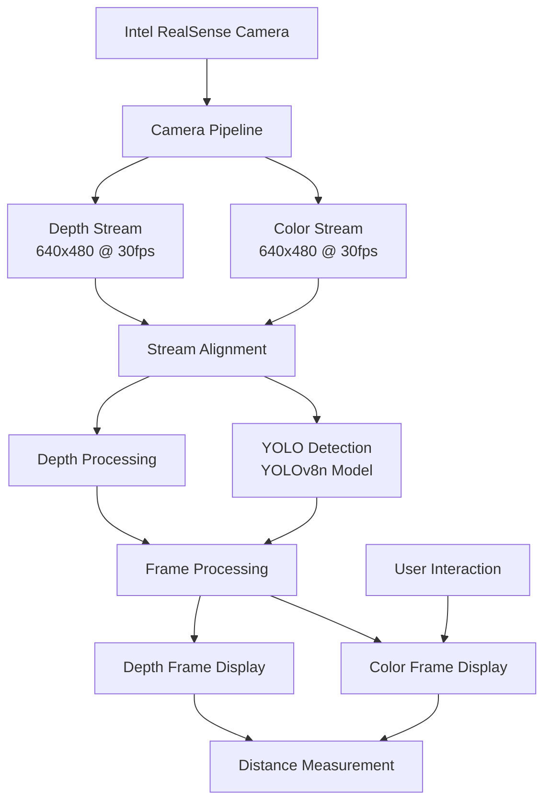

# Intel RealSense Camera Object Detection and Distance Measurement


## 📝 Table of Contents
- [About](#about)
- [System Architecture](#system-architecture)
- [Features](#features)
- [Prerequisites](#prerequisites)
- [Installation](#installation)
- [Usage](#usage)
- [Technical Details](#technical-details)
- [Code Structure](#code-structure)
- [Results](#results)
- [Author](#author)
- [Acknowledgments](#acknowledgments)

## 🎯 About

This project combines Intel RealSense depth sensing technology with YOLOv8 object detection to create a sophisticated real-time object detection and distance measurement system. It provides an interactive interface for measuring distances to detected objects and specific points in the camera's field of view, with depth visualization capabilities.

## 🏗 System Architecture



## ✨ Features

### Core Capabilities
- **Real-time Object Detection**: 
  - Powered by YOLOv8 neural network
  - Multi-object detection with confidence scores
  - Automatic object classification

### Distance Measurement
- **Point-to-Point Distance**: 
  - Click-based distance measurement
  - Real-time distance updates
  - Metric unit display (meters)

### Visualization
- **Dual Display Windows**:
  - Color frame with object detection
  - Depth frame with color mapping
- **Interactive Elements**:
  - Bounding boxes for detected objects
  - Distance labels
  - Color-coded depth visualization

### System Features
- **Robust Camera Handling**:
  - Automatic camera initialization
  - Error recovery with retry mechanism
  - Stream alignment for accurate measurements

## 🔧 Prerequisites

### Hardware Requirements
- Intel RealSense Depth Camera (D400 series recommended)
- USB 3.0 port
- Computing system with:
  - Processor: Intel Core i5 or better
  - RAM: 8GB minimum
  - GPU: Recommended for better YOLO performance

### Software Requirements
```plaintext
- Python 3.8 or higher
- Intel RealSense SDK 2.0
- OpenCV (cv2)
- NumPy
- Ultralytics YOLO
- pyrealsense2
```

## 📥 Installation

### 1. Intel RealSense SDK Installation

#### Windows:
1. Download SDK from [Intel RealSense SDK 2.0](https://www.intelrealsense.com/sdk-2/)
2. Run the installer and follow the prompts
3. Restart your system after installation

#### Ubuntu:
```bash
sudo apt-get update && sudo apt-get upgrade
sudo apt-key adv --keyserver keyserver.ubuntu.com --recv-key F6E65AC044F831AC80A06380C8B3A55A6F3EFCDE
sudo add-apt-repository "deb https://librealsense.intel.com/Debian/apt-repo $(lsb_release -cs) main"
sudo apt-get install librealsense2-dkms librealsense2-utils librealsense2-dev
```

### 2. Python Dependencies
```bash
# Create and activate virtual environment (recommended)
python -m venv venv
source venv/bin/activate  # Linux/Mac
venv\Scripts\activate     # Windows

# Install required packages
pip install pyrealsense2
pip install opencv-python
pip install numpy
pip install ultralytics
```

### 3. Project Setup
```bash
# Clone the repository
git clone https://github.com/your-username/realsense-object-detection.git

# Navigate to project directory
cd realsense-object-detection

# Verify installation
python camera_viewer.py
```

## 🎮 Usage

### Running the Application
1. Connect your RealSense camera
2. Open terminal/command prompt
3. Navigate to project directory
4. Run:
   ```bash
   python camera_viewer.py
   ```

### Interactive Features
- **Distance Measurement**:
  - Left-click anywhere in the color frame
  - Distance will be displayed in meters
- **Object Detection**:
  - Objects automatically detected
  - Bounding boxes show object class and distance
- **Exit Application**:
  - Press 'q' to quit

## 🔍 Technical Details

### Camera Configuration
```python
# Stream Configuration
config.enable_stream(rs.stream.depth, 640, 480, rs.format.z16, 30)
config.enable_stream(rs.stream.color, 640, 480, rs.format.bgr8, 30)
```

### Frame Processing Pipeline
1. Camera frame capture
2. Stream alignment
3. YOLO object detection
4. Depth measurement
5. Visualization overlay
6. Display output

### Distance Calculation
```python
def get_distance(self, depth_frame, point):
    return depth_frame[point[1], point[0]] * self.depth_scale
```

## 📁 Code Structure

### Files Organization
```plaintext
realsense-object-detection/
├── camera_viewer.py       # Main application script
├── realsense_camera.py    # Camera handling class
├── requirements.txt       # Dependencies list
└── README.md             # Documentation
```

### Key Components
1. **RealsenseCamera Class**: Core functionality
   - Camera initialization
   - Frame processing
   - Object detection
   - Distance measurement

2. **Main Application**: User interface
   - Window management
   - Event handling
   - Visualization
   - User interaction

## 📊 Results

The system provides:
- Real-time object detection and tracking
- Accurate distance measurements
- Interactive point selection
- Depth visualization
- Robust error handling

## 👤 Author

* **Md Khairul Islam**
   * Institution: Hobart and William Smith Colleges, Geneva, NY
   * Major: Robotics and Computer Science
   * Contact: khairul.islam@hws.edu

## 🙏 Acknowledgments

- Intel RealSense Team for the comprehensive SDK
- Ultralytics for YOLOv8
- OpenCV community
- Python community

## 📚 Additional Resources

- [Intel RealSense Documentation](https://dev.intelrealsense.com/docs/)
- [YOLOv8 Documentation](https://docs.ultralytics.com/)
- [OpenCV Documentation](https://docs.opencv.org/)

---

## 📄 License

This project is licensed under the MIT License - see the [LICENSE](LICENSE) file for details.

