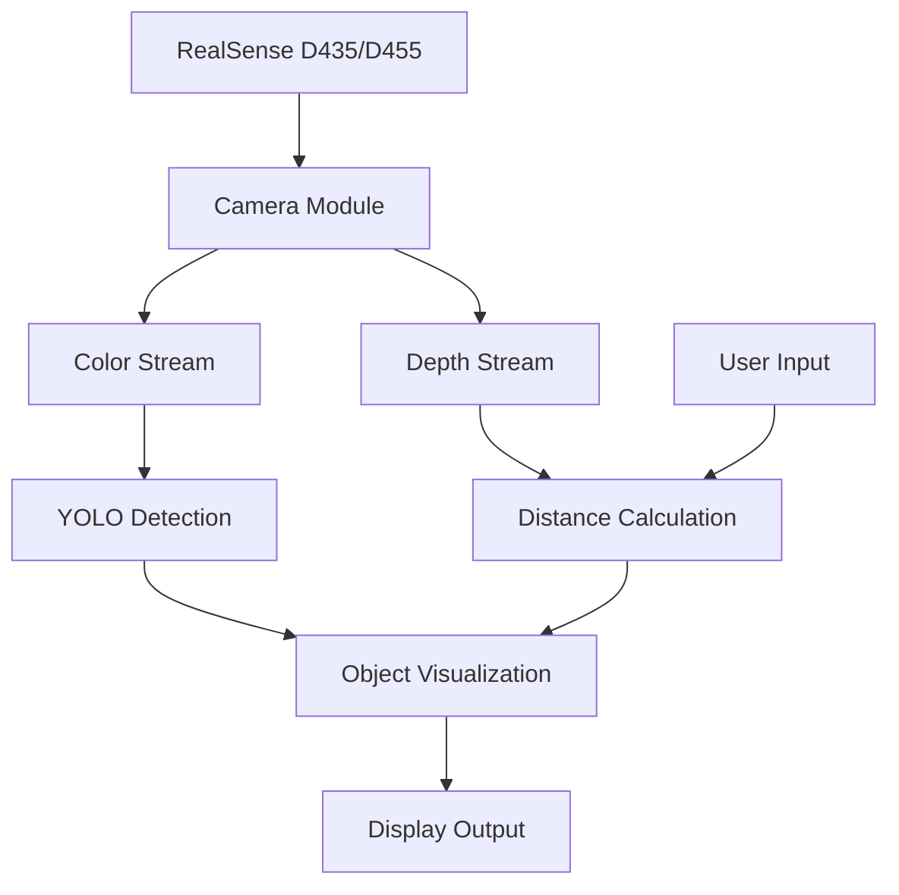
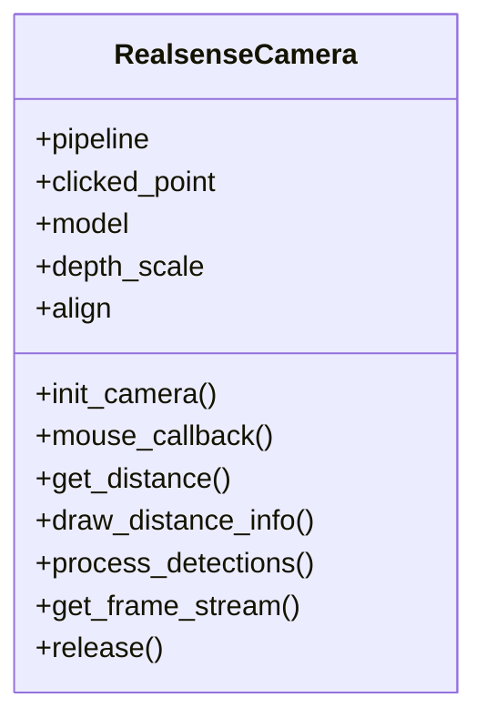

# RealSense Object Detection & Distance Measurement 🎥📏

A Python application that combines Intel RealSense depth camera capabilities with YOLOv8 object detection to provide real-time object detection and precise distance measurements.


## Features 🌟

- **Real-time Object Detection**: Using YOLOv8 for accurate object identification
- **Distance Measurement**: Precise depth sensing using Intel RealSense camera
- **Interactive Interface**: Click-to-measure functionality for custom point measurements
- **Visual Feedback**: Color-coded depth visualization and object bounding boxes
- **Multi-Object Tracking**: Detection and distance measurement for multiple objects simultaneously

## System Architecture 📐



## Requirements 📋

### Hardware
- Intel RealSense D435 or D455 depth camera
- USB 3.0 port
- Computer with minimum 8GB RAM (16GB recommended)

### Software
- Python 3.8 or higher
- Intel RealSense SDK 2.0
- Required Python packages:
  ```
  pyrealsense2
  opencv-python
  numpy
  ultralytics
  ```

## Installation 🔧

1. **Clone the repository**
   ```bash
   git clone https://github.com/yourusername/realsense-object-detection.git
   cd realsense-object-detection
   ```

2. **Install Intel RealSense SDK 2.0**
   - Download from [Intel RealSense SDK 2.0](https://www.intelrealsense.com/sdk-2/)
   - Follow installation instructions for your operating system

3. **Set up Python environment**
   ```bash
   # Create virtual environment
   python -m venv venv

   # Activate virtual environment
   # On Windows:
   .\venv\Scripts\activate
   # On Linux/Mac:
   source venv/bin/activate

   # Install required packages
   pip install -r requirements.txt
   ```

## Usage 💻

1. **Connect your RealSense camera** to a USB 3.0 port

2. **Run the application**
   ```bash
   python camera_viewer.py
   ```

3. **Interact with the application**
   - Click anywhere on the color image to measure distance to that point
   - Objects will be automatically detected and labeled with distances
   - Press 'q' to quit the application

## Code Structure 🏗️

```
project/
│
├── realsense_camera.py     # Main camera and processing class
├── camera_viewer.py        # Application entry point and UI
└── requirements.txt        # Project dependencies
```

### Class Diagram



## Features in Detail 🔍

### Distance Measurement
- Real-time depth measurements in meters
- Click-to-measure functionality
- Visual feedback with distance overlay

### Object Detection
- YOLOv8 integration for real-time detection
- Multiple object class support
- Confidence scores display
- Bounding box visualization

### Depth Visualization
- Color-mapped depth display
- Aligned color and depth frames
- Interactive measurement points

## Examples 📸

Here's what you'll see when running the application:

1. **Color Stream with Object Detection**
   - RGB image with bounding boxes
   - Object labels and confidence scores
   - Distance measurements

2. **Depth Visualization**
   - Color-coded depth map
   - Blue (far) to red (near) visualization
   - Interactive measurement points

## Troubleshooting 🔧

Common issues and solutions:

1. **Camera Not Found**
   - Ensure camera is connected to USB 3.0 port
   - Check if Intel RealSense SDK is properly installed
   - Try unplugging and reconnecting the camera

2. **Slow Performance**
   - Reduce frame resolution in settings
   - Ensure adequate system resources
   - Close other applications using the camera

3. **Installation Issues**
   - Update system packages
   - Install build tools for your OS
   - Check Python version compatibility

## Contributing 🤝

1. Fork the repository
2. Create a feature branch
3. Commit your changes
4. Push to the branch
5. Create a Pull Request

## License 📄

This project is licensed under the MIT License - see the [LICENSE](LICENSE) file for details.

## Acknowledgments 🙏

- Intel RealSense SDK
- Ultralytics YOLOv8
- OpenCV community
- Python community

## Contact 📧

For questions or feedback, please:
- Open an issue in this repository
- Contact: [Your Contact Information]

---
